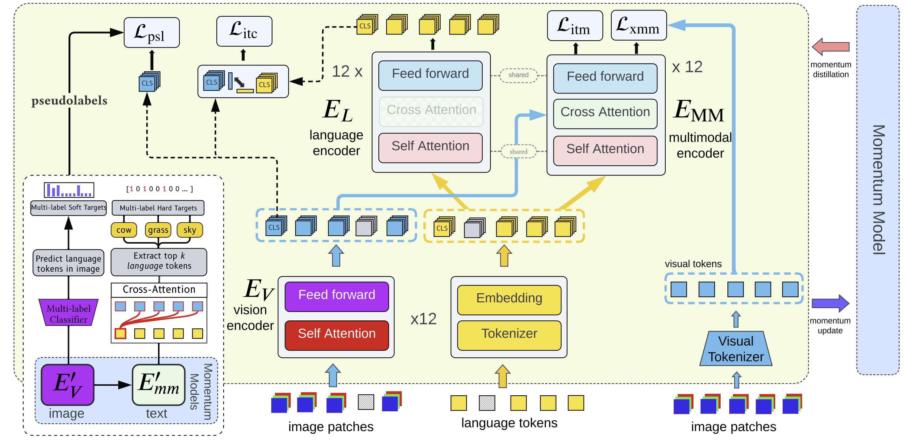

[](https://papers.nips.cc/book/advances-in-neural-information-processing-systems-31-2018)
[](https://arxiv.org/abs/2203.14395)

# SIMLA: Single-Stream Multi-Level Alignment for Vision-Language Pretraining, ECCV 2022 (NEC Labs)
This is the official PyTorch implementation of [SIMLA](https://arxiv.org/abs/2203.14395).
The repository is heavily based on [salesforce/ALBEF](https://github.com/salesforce/ALBEF), and supports vision-language pretraining and downstream task finetuning for several tasks.



## Checkpoints

- [pretrained on 4m images](https://drive.google.com/file/d/1fALNNEJM6bNkVhY4vDlT8JnSWhkQ1Sop/view?usp=sharing)
    - Use this one if you want to finetune the model for another downstream VL task, like VQA. 
- [finetuned on COCO](https://drive.google.com/file/d/16S99bJ-tCAYX0IcN6FM-W-yzD59F2UdV/view?usp=sharing)
    - Use this one for retrieval tasks.

The checkpoints are around 3GB, and contain the optimizer state and everything else needed to resume training.


## Pretraining
```bash
python -m torch.distributed.launch --nproc_per_node=2 --use_env Pretrain.py --config configs/Pretrain.yaml --output_dir <where to save> 
```

## Image Text Retrieval
### Finetuned (COCO)
```bash
python -m torch.distributed.launch --master_port=49770 --nproc_per_node=2 --use_env Retrieval.py \
--config ./configs/Retrieval_coco.yaml \
--output_dir <path/to/output> \
--checkpoint <path/to/checkpoint.pth>
```

### Zero-Shot (Flickr)
```bash
python -m torch.distributed.launch --master_port=47770 --nproc_per_node=2 --use_env zero_shot_retrieval.py --config ./configs/Retrieval_flickr.yaml --output_dir <where to save> --checkpoint <path of .pth checkpoint file> --evaluate
```

### Finetuned (Flickr) 
```bash
python -m torch.distributed.launch --master_port=49770 --nproc_per_node=2 --use_env Retrieval.py \
--config ./configs/Retrieval_flickr.yaml \
--output_dir <path/to/output> \
--checkpoint <path/to/checkpoint.pth>
```

## RefCOCO+ (Visual Grounding) 
```bash
python -m torch.distributed.launch --master_port=49121 --nproc_per_node=2 --use_env Grounding.py \
--config ./configs/Grounding.yaml \
--output_dir <path/to/output> \
--gradcam_mode itm \
--block_num 8 \
--checkpoint <path/to/checkpoint.pth> \
```

## VQA (Visual Question Answering)
```bash
python -m torch.distributed.launch --nproc_per_node=2 --use_env VQA.py \
--config ./configs/VQA.yaml \
--output_dir <path/to/output> \
--checkpoint <path/to/checkpoint.pth> 
```
## NLVR (Natural Language Visual Reasoning)
### Pretraining
```bash
python -m torch.distributed.launch --nproc_per_node=2 --use_env Pretrain_NLVR.py \
--config ./configs/NLVR_Pretrain.yaml \
--output_dir <path/to/output> \
--checkpoint <path/to/checkpoint.pth> 
```
### Finetuning
```bash
python -m torch.distributed.launch --nproc_per_node=2 --use_env NLVR.py \
--config ./configs/NLVR.yaml \
--output_dir <path/to/output> \
--checkpoint <path/to/checkpoint.pth>
```
## SNLI-VE (Visual Entailment)
```bash
python -m torch.distributed.launch --master_port=47770 --nproc_per_node=2 \
--use_env VE.py \
--config ./configs/VE.yaml \
--output_dir <path/to/output> \
--checkpoint <path/to/checkpoint.pth>
```

## Citation
```
@inproceedings{SIMLA,
      title={Single-Stream Multi-Level Alignment for Vision-Language Pretraining, 
      author={Zaid Khan and Vijay Kumar BG and Xiang Yu and Samuel Schulter and Manmohan Chandraker and Yun Fu},
      year={2022},
      booktitle={ECCV}
}
```