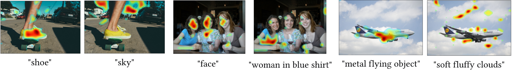

# Single-Stream Multi-Level Alignment for Vision-Language Pretraining

Self-supervised vision-language pretraining from pure images and text with a contrastive loss is effective, but ignores fine-grained alignment due to a dual-stream architecture that aligns image and text representations only on a global level.
Earlier, supervised, non-contrastive methods were capable of finer-grained alignment, but required dense annotations that were not scalable. 
We propose a single stream architecture that aligns images and language at multiple levels: global, fine-grained patch-token, and conceptual/semantic, using two novel tasks: symmetric cross-modality reconstruction (XMM) and a pseudo-labeled key word prediction (PLS). In XMM, we mask input tokens from one modality and use cross-modal information to reconstruct the masked token, thus improving fine-grained alignment between the two modalities. In PLS, we use attention to select keywords in a caption, use a momentum encoder to recommend other important keywords that are missing from the caption but represented in the image, and then train the visual encoder to predict the presence of those keywords, helping it learn semantic concepts that are essential for grounding a textual token to an image region. 
We demonstrate competitive performance and improved data efficiency on image-text retrieval, grounding, visual question answering/reasoning against larger models and models trained on more data.